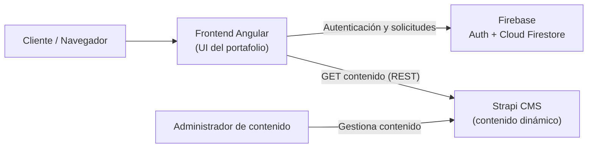

# DevPortafolio — Aplicación Web Portafolio de Servicios

Aplicación web tipo portafolio profesional multiusuario que presenta los perfiles de dos
programadores, sus proyectos y servicios, y permite que usuarios externos autenticados envíen
solicitudes de contacto a un programador, quien puede revisarlas y responderlas.

Proyecto Integrador de la asignatura **Programación y Plataformas Web** — Carrera de Computación,
Universidad Politécnica Salesiana.

---

## Enlaces del proyecto

| Recurso | Enlace |
|---|---|
| Aplicación desplegada (frontend) | https://jona142004.github.io/Proyecto_interciclo/ |
| API / CMS desplegado (Strapi) | https://holy-purpose-7c0a2b8602.strapiapp.com |
| Repositorio del frontend (Angular) | https://github.com/Jona142004/Proyecto_interciclo |
| Repositorio del CMS (Strapi) | https://github.com/Jona142004/portafolio-strapi |

---

## Autores

- **Jonnathan Parraga** — Desarrollo Backend — [GitHub](https://github.com/Jona142004)
- **María Verónica Cobos** — Desarrollo Frontend — [GitHub](https://github.com/mvcobos)

---

## Tabla de contenido

1. [Arquitectura del sistema](#arquitectura-del-sistema)
2. [Tecnologías utilizadas](#tecnologías-utilizadas)
3. [Funcionalidades implementadas](#funcionalidades-implementadas)
4. [Modelo de datos](#modelo-de-datos)
5. [Proceso de desarrollo](#proceso-de-desarrollo)
6. [Decisiones de diseño](#decisiones-de-diseño)
7. [Desafíos enfrentados](#desafíos-enfrentados)
8. [Configuración del entorno local](#configuración-del-entorno-local)
9. [Guía de despliegue](#guía-de-despliegue)
10. [Guía de usuario](#guía-de-usuario)
11. [Estructura del proyecto](#estructura-del-proyecto)

---

## Arquitectura del sistema

La aplicación se organiza bajo una clara **separación de responsabilidades** entre tres servicios:



- **Angular (frontend):** muestra la interfaz del portafolio, consume los endpoints REST de Strapi,
  gestiona el inicio de sesión con Firebase Authentication y realiza operaciones sobre las
  solicitudes almacenadas en Firestore.
- **Firebase Authentication:** registro e inicio de sesión de usuarios mediante correo electrónico
  y contraseña (y, opcionalmente, cuenta de Google).
- **Cloud Firestore:** almacena las solicitudes de contacto. Cada solicitud queda asociada al
  usuario autenticado (su `uid`) y al programador seleccionado.
- **Strapi CMS (Headless):** administra el contenido dinámico del portafolio (programadores,
  proyectos, servicios y tecnologías), sin necesidad de desarrollar un panel administrativo propio
  en Angular.

---

## Tecnologías utilizadas

| Capa | Tecnología |
|---|---|
| Frontend | Angular 21 (componentes standalone, signals, control de flujo nativo) |
| Autenticación | Firebase Authentication (correo/contraseña + Google opcional) |
| Base de datos de solicitudes | Cloud Firestore |
| Integración Angular–Firebase | AngularFire (`@angular/fire` v21) |
| CMS / contenido | Strapi 5 (Headless CMS) |
| Base de datos del CMS | SQLite (local) / gestionada por Strapi Cloud (producción) |
| Lenguaje | TypeScript |
| Hosting frontend | GitHub Pages |
| Hosting CMS | Strapi Cloud |

---

## Funcionalidades implementadas

- **Página Home:** sección hero de presentación, tarjetas de perfil de ambos programadores, listado
  de servicios, proyectos destacados (obtenidos desde Strapi mediante el atributo `destacado`) y
  sección de contacto.
- **Perfil individual del programador:** muestra toda la información del programador y sus proyectos.
  Un proyecto relacionado con ambos programadores aparece en el perfil de los dos (relación
  muchos a muchos).
- **Detalle de proyecto:** descripción, tipo, tecnologías, enlace al repositorio y programadores
  participantes.
- **Autenticación:** registro de usuarios externos con correo y contraseña, inicio y cierre de
  sesión. Las cuentas de los programadores se crean en Firebase Authentication y su perfil público
  se administra como contenido en Strapi.
- **Solicitudes de contacto:** un usuario autenticado puede enviar una solicitud a un programador
  (nombre, correo, descripción del proyecto, programador destino), con fecha automática y estado
  inicial *Pendiente*. La solicitud se guarda en Firestore asociada al `uid` del usuario y al
  programador seleccionado.
- **Gestión de solicitudes:**
  - El **usuario externo** ve las solicitudes que ha enviado y la respuesta del programador.
  - El **programador** ve las solicitudes recibidas, puede cambiar el estado
    (*Pendiente* / *Respondida*) y registrar una observación o respuesta, guardándose la
    actualización en Firestore.
- **Interfaz responsive:** diseño adaptable a escritorio y dispositivos móviles, con diferenciación
  visual entre la vista pública, la del usuario autenticado y la del programador.

---

## Modelo de datos

### Contenido en Strapi (colecciones)

**Programador:** `nombreCompleto`, `especialidad`, `descripcionBreve`, `descripcionCompleta`,
`fotoPerfil` (media), `correoContacto`, `github`, `linkedin`, `activo`, `slug`, y relación con
`proyectos`.

**Proyecto:** `nombre`, `slug`, `descripcionBreve`, `descripcionCompleta`, `imagenPrincipal`
(media), `tipo` (*academico* / *personal* / *laboral* / *simulado*), `repositorio`, `demo`,
`destacado`, y relaciones muchos a muchos con `programadors` y `tecnologias`.

**Servicio:** `nombre`, `descripcion`, `icono`.

**Tecnologia:** `nombre`, `logo` (media).

### Solicitudes en Cloud Firestore

Colección **`solicitudes`**, donde cada documento contiene:

| Campo | Descripción |
|---|---|
| `nombreSolicitante` | Nombre del solicitante |
| `correoSolicitante` | Correo del solicitante |
| `descripcionProyecto` | Idea o descripción del proyecto |
| `programadorSlug` / `programadorNombre` / `programadorEmail` | Programador al que se dirige |
| `uid` / `usuarioEmail` | Usuario autenticado que la envía |
| `estado` | *Pendiente* o *Respondida* |
| `respuesta` | Observación o respuesta del programador |
| `fechaCreacion` | Fecha de creación automática (timestamp) |

---

## Proceso de desarrollo

El desarrollo siguió un orden incremental basado en las dependencias del sistema:

1. **Definición del contenido en Strapi:** se configuró Strapi como CMS Headless y se crearon las
   colecciones (Programador, Proyecto, Servicio, Tecnologia) con sus campos y relaciones, además de
   habilitar los permisos públicos de lectura del API.
2. **Configuración de Firebase:** se creó el proyecto, se habilitó Authentication con correo y
   contraseña y se creó la base de datos Cloud Firestore.
3. **Conexión del frontend:** se integró Angular con Firebase (mediante AngularFire) y con Strapi
   (mediante el cliente HTTP), centralizando la configuración en los archivos de entorno.
4. **Construcción de servicios y componentes:** servicios para consumir Strapi, gestionar la
   autenticación y manejar las solicitudes en Firestore; y las páginas (Home, perfil, detalle de
   proyecto, login, registro, formulario de solicitud y bandeja de solicitudes).
5. **Pruebas del flujo completo:** registro de usuario, envío de solicitud, recepción y respuesta
   por parte del programador.
6. **Despliegue:** publicación del CMS en Strapi Cloud y del frontend en GitHub Pages.

---

## Decisiones de diseño

- **CMS Headless (Strapi):** se eligió para separar el contenido del código. Esto permite editar
  programadores, proyectos y servicios desde un panel de administración sin modificar ni recompilar
  la aplicación Angular.
- **Firebase para autenticación y solicitudes:** se utilizó Firebase Authentication y Firestore para
  contar con autenticación segura y una base de datos en tiempo real sin necesidad de implementar un
  backend propio.
- **Detección de rol por correo:** los programadores son contenido en Strapi, pero su cuenta de
  acceso vive en Firebase. Como no existe un campo de "rol" en Firebase, el sistema determina si un
  usuario autenticado es programador comparando su correo con el campo `correoContacto` de los
  programadores registrados en Strapi. Si coincide, se le muestran las solicitudes recibidas; si no,
  las enviadas.
- **Relación muchos a muchos (Proyecto ↔ Programador):** permite que un proyecto pertenezca a uno o
  varios programadores, de modo que un proyecto compartido aparece automáticamente en el perfil de
  ambos.
- **Exploración pública, acción autenticada:** cualquier visitante puede explorar el portafolio sin
  iniciar sesión, pero debe autenticarse para enviar una solicitud de contacto.
- **Angular moderno:** se usaron componentes standalone, signals y el control de flujo nativo
  (`@if` / `@for`), siguiendo las buenas prácticas actuales del framework.

---

## Desafíos enfrentados

- **Conflicto de versiones entre AngularFire y Firebase:** el reto técnico más complejo. El proyecto
  usa Angular 21 (versión muy reciente), y la combinación inicial de `@angular/fire` con la versión
  de `firebase` instalada provocó que coexistieran dos copias distintas del SDK de Firestore. Esto
  generaba el error *"Type does not match the expected instance. Did you pass a reference from a
  different Firestore SDK?"* al consultar la base de datos. Se resolvió alineando las versiones e
  instalando la versión de AngularFire correspondiente a Angular 21.
- **Sincronización asíncrona:** al cargar la bandeja de solicitudes, era necesario esperar a que
  Firebase resolviera la sesión del usuario y a que Strapi devolviera la lista de programadores
  antes de decidir el rol y consultar Firestore. Se solucionó encadenando los flujos con RxJS
  (esperando el estado de autenticación y luego la respuesta de Strapi antes de lanzar la consulta).
- **Publicación de contenido en Strapi 5:** Strapi 5 usa el sistema *Draft & Publish*; el contenido
  guardado como borrador no se expone en el API público. Fue necesario publicar explícitamente cada
  entrada.
- **Permisos del API:** por defecto el rol *Public* de Strapi no permite leer las colecciones, lo que
  producía errores 403. Se habilitaron los permisos `find` y `findOne` para cada colección.
- **Migración de contenido al desplegar:** la base de datos local (SQLite) y las imágenes no se
  versionan en el repositorio, por lo que la instancia de Strapi Cloud se creó vacía y el contenido
  tuvo que recrearse en el panel de producción.
- **Despliegue en GitHub Pages:** al publicarse en una subcarpeta, fue necesario compilar con el
  `base-href` correcto para que la aplicación cargara adecuadamente.

---

## Configuración del entorno local

### Requisitos previos

- **Node.js** versión 20 o superior (Strapi 5 requiere una versión LTS par: 20, 22 o 24).
- **npm** (incluido con Node).
- Una cuenta de **Firebase** y otra de **Strapi Cloud** (para producción).

### 1. Backend — Strapi (CMS)

```bash
cd portafolio-cms        # carpeta del proyecto Strapi
npm install
npm run develop
```

Esto levanta Strapi en `http://localhost:1337`. La primera vez se debe crear una cuenta de
administrador en `http://localhost:1337/admin`.

Luego, en el panel:
- En **Settings → Users & Permissions Plugin → Roles → Public**, habilitar `find` y `findOne` para
  las colecciones Programador, Proyecto, Servicio y Tecnologia.
- En **Content Manager**, crear y **publicar** el contenido.

### 2. Firebase

En la [consola de Firebase](https://console.firebase.google.com):
- Crear un proyecto.
- Habilitar **Authentication → Sign-in method → Email/Password**.
- Crear una base de datos **Cloud Firestore**.
- Registrar una aplicación web y copiar el objeto de configuración (`firebaseConfig`).

### 3. Frontend — Angular

```bash
cd icc-ppw-proyecto
npm install
```

Configurar los archivos de entorno con la configuración de Firebase y la URL de Strapi:

`src/environments/environment.development.ts` (desarrollo, usa Strapi local):

```typescript
export const environment = {
  production: false,
  firebase: { /* configuración de Firebase */ },
  strapiUrl: "http://localhost:1337"
};
```

`src/environments/environment.ts` (producción, usa Strapi en la nube):

```typescript
export const environment = {
  production: true,
  firebase: { /* configuración de Firebase */ },
  strapiUrl: "https://holy-purpose-7c0a2b8602.strapiapp.com"
};
```

Ejecutar la aplicación:

```bash
ng serve
```

La aplicación quedará disponible en `http://localhost:4200`. Para que el contenido se muestre, Strapi
debe estar corriendo en paralelo.

---

## Guía de despliegue

### Backend (Strapi Cloud)

1. Subir la carpeta del proyecto Strapi a un repositorio de GitHub.
2. En [Strapi Cloud](https://cloud.strapi.io), crear un proyecto conectando ese repositorio
   (rama `main`).
3. Esperar a que el despliegue finalice. Strapi Cloud entrega una URL pública
   (`https://...strapiapp.com`).
4. En el panel de producción (`/admin`), crear el usuario administrador, habilitar los permisos
   públicos y recrear/publicar el contenido.

### Frontend (GitHub Pages)

1. Subir el código del frontend a GitHub.
2. Confirmar que `src/environments/environment.ts` apunta a la URL de Strapi Cloud.
3. Instalar la herramienta de publicación:

   ```bash
   npm install angular-cli-ghpages --save-dev --legacy-peer-deps
   ```
4. Compilar con el `base-href` del repositorio:

   ```bash
   ng build --configuration production --base-href "https://jona142004.github.io/Proyecto_interciclo/"
   ```
5. Publicar en GitHub Pages:

   ```bash
   npx angular-cli-ghpages --dir=dist/proyecto/browser
   ```
6. En el repositorio, en **Settings → Pages**, verificar que la fuente sea la rama `gh-pages`.

> **Nota:** el dominio de la aplicación desplegada debe agregarse en Firebase, en
> **Authentication → Settings → Authorized domains**, para permitir la autenticación desde el sitio
> público.

---

## Guía de usuario

### Para el administrador (gestión de contenido)

El administrador gestiona el contenido del portafolio desde el panel de Strapi
(`https://holy-purpose-7c0a2b8602.strapiapp.com/admin`):

1. Iniciar sesión con la cuenta de administrador.
2. Ir a **Content Manager**.
3. Crear o editar entradas en las colecciones **Programador**, **Proyecto**, **Servicio** y
   **Tecnologia**.
4. En los proyectos, asignar los **programadores** y **tecnologías** correspondientes, y marcar como
   **destacado** los que deban aparecer en la página principal.
5. **Publicar** cada entrada (botón *Publish*); de lo contrario no se mostrará en la aplicación.

### Para el usuario externo

1. **Explorar el portafolio** sin necesidad de iniciar sesión: ver el Home, los perfiles de los
   programadores y los proyectos.
2. **Registrarse** con un correo y contraseña desde la opción *Registrarse*.
3. **Iniciar sesión**.
4. Ir a la sección de contacto / *Solicitar servicio*, completar el formulario (nombre, correo,
   descripción del proyecto y programador destino) y enviarlo.
5. En **Mis solicitudes**, consultar el estado de las solicitudes enviadas y la respuesta del
   programador.

### Para el programador

1. **Iniciar sesión** con la cuenta de Firebase asociada a su correo de contacto registrado en
   Strapi.
2. Ir a **Mis solicitudes**, donde se muestran las solicitudes recibidas.
3. Por cada solicitud, **cambiar el estado** (Pendiente / Respondida) y **escribir una respuesta u
   observación**.
4. Guardar la actualización; los cambios se almacenan en Firestore y el usuario solicitante podrá
   ver la respuesta.

---

## Estructura del proyecto

```
Proyecto_interciclo/ (frontend Angular)
├── src/
│   ├── app/
│   │   ├── components/        # Componentes reutilizables
│   │   ├── guards/            # Protección de rutas (authGuard)
│   │   ├── models/           # Interfaces de datos
│   │   ├── pages/            # Home, perfil, detalle, login, registro, solicitudes
│   │   ├── services/         # StrapiService, AuthService, SolicitudesService
│   │   ├── app.config.ts     # Providers (router, HttpClient, Firebase)
│   │   └── app.routes.ts     # Rutas de la aplicación
│   └── environments/         # Configuración (Firebase + URL de Strapi)
└── angular.json

portafolio-strapi/ (CMS Strapi)
├── config/
├── src/
│   └── api/                  # Colecciones: programador, proyecto, servicio, tecnologia
└── package.json
```
